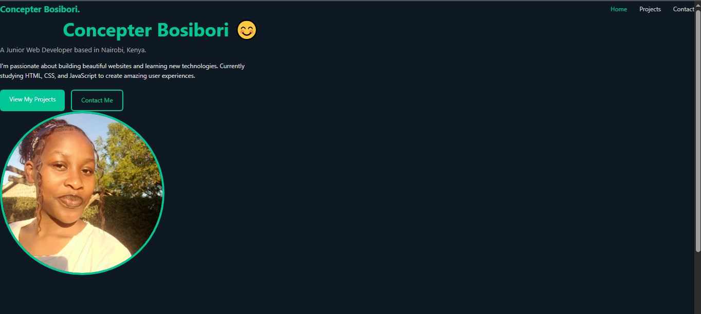
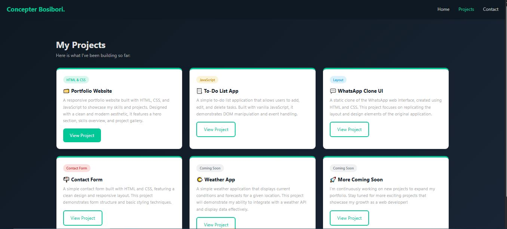
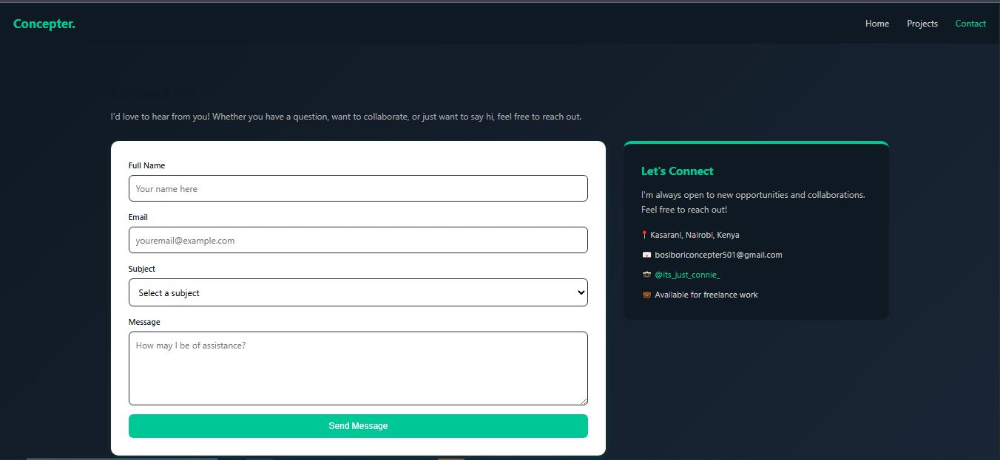

# Week 02: CSS Styling & Responsive Design

## Author
- **Name:** Concepter Bosibori
- **GitHub:** [@Connie-cloud-svg](https://github.com/Connie-cloud-svg)
- **Date:** March 27, 2026

## Project Description
A fully responsive personal portfolio website built with HTML5 and CSS3.
The portfolio showcases my skills, projects, and contact information across
three separate pages, designed mobile-first with an Emerald Dev colour theme.

## Technologies Used
- HTML5 (Semantic)
- CSS3 (Flexbox, Grid, Media Queries, CSS Variables)

## Features
- Mobile-first responsive design with 3 breakpoints (768px, 1024px, 1280px)
- CSS-only hamburger menu for mobile navigation
- Automatic dark mode based on system preference
- Hover effects and smooth transitions on buttons and cards
- Emerald Dev colour theme with gradient backgrounds
- Coloured project card tags per category
- Accessible focus states for keyboard navigation

## How to Run
1. Clone this repository
2. Open `index.html` in your browser

## Lessons Learned
- How to structure a multi-page website with shared CSS
- Mobile-first design approach using media queries
- The difference between Flexbox and CSS Grid and when to use each
- How to use CSS variables for consistent theming
- The importance of semantic HTML tags over generic divs
- How semantic CSS class naming improves readability and maintainability

## Challenges Faced
- Fixing a broken local image path that only worked on my own computer —
  solved by moving the image into the project folder and using a relative path
- Understanding why the reset CSS made everything look broken at first —
  learned that this is expected before adding custom styles
- Git push not working because the project folder was nested inside the
  wrong repository — solved by uploading files directly through GitHub

## Screenshots 

## Live Demo 
https://connie-cloud-svg.github.io/iyf-s10-week-02-Connie-cloud-svg/
